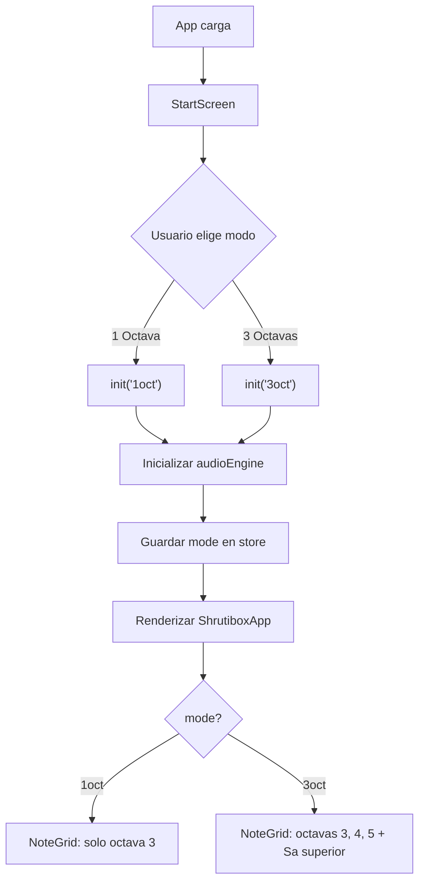
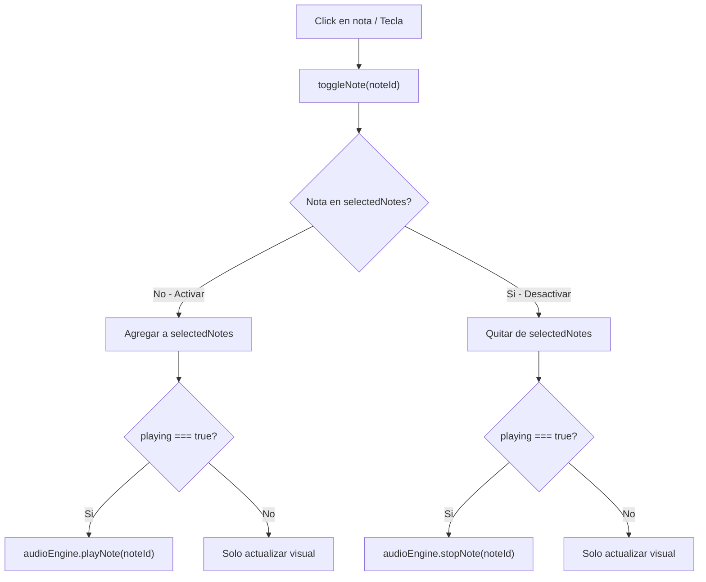
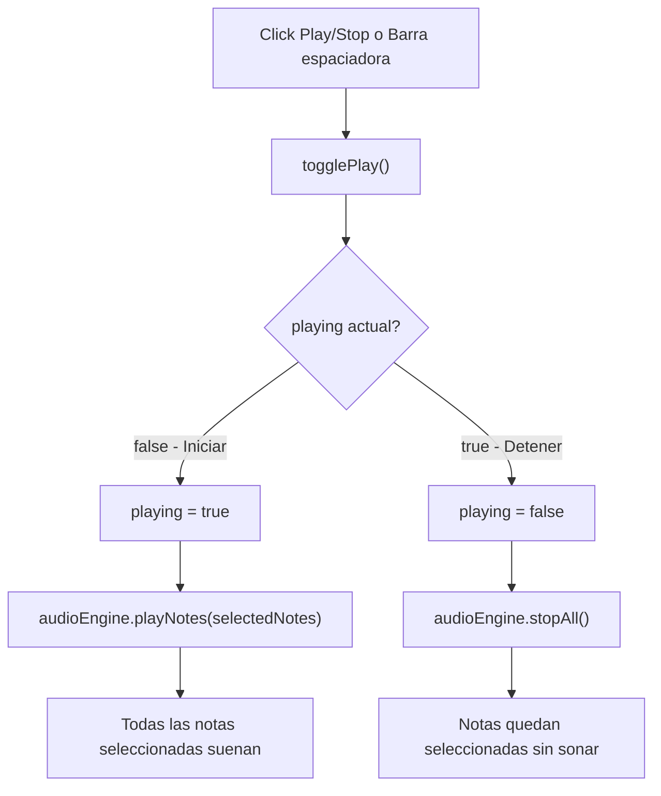
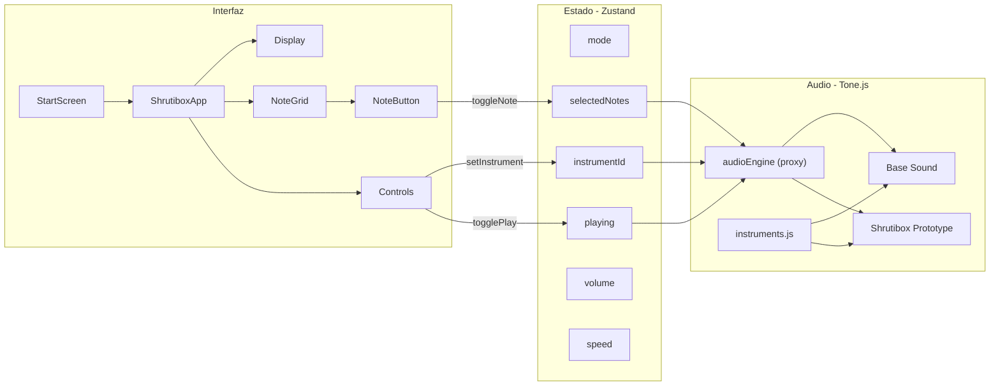

# Shrutibox Digital

Replica digital de un shrutibox acustico **Monoj Kumar Sardar 440Hz**, construida como aplicacion web con dos motores de audio: sintesis en tiempo real y reproduccion de samples pregrabados.

El instrumento simula la experiencia de un shrutibox real: primero se seleccionan las notas (como abrir las lengüetas del instrumento), luego se activa la reproduccion (como bombear el fuelle) para generar el drone continuo.

## Caracteristicas

- **Selector de modo**: elige entre shrutibox de 1 octava (C3) o 3 octavas completas (C3-C6)
- **Selector de instrumentos**: elige entre diferentes motores de audio desde la UI (Base Sound, Shrutibox Prototype), extensible a futuro
- **Sistema Sargam**: 7 notas por octava (Sa, Re, Ga, Ma, Pa, Dha, Ni) con notacion occidental
- **Toggle + Play/Stop**: selecciona notas con click, luego activa el drone con Play
- **Modificacion en tiempo real**: agrega o quita notas mientras el drone suena
- **Control de volumen**: ajuste de 0% a 100%
- **Control de velocidad**: modifica attack/release del envelope (0.25x a 3x)
- **Teclado fisico**: teclas A-J para las 7 notas, barra espaciadora para Play/Stop
- **Selector de octava**: elige que octava controla el teclado (en modo 3 octavas)

## Stack tecnologico

| Tecnologia   | Version | Uso                              |
| ------------ | ------- | -------------------------------- |
| React        | 19.2.0  | UI con componentes funcionales   |
| Vite         | 7.3.1   | Bundler y servidor de desarrollo |
| Tone.js      | 15.1.22 | Sintesis y reproduccion de audio |
| Zustand      | 5.0.11  | Estado global reactivo           |
| Tailwind CSS | 4.2.0   | Estilos utility-first            |

## Estructura del proyecto

```
shrutibox-os-custom/
├── public/
│   ├── original-sounds/        # Audio fuente para generar samples
│   │   └── 95345__iluppai__shruti-box.wav
│   └── sounds/                 # Samples generados organizados por octava (gitignored)
│       ├── octave_3/           # Octava 3 (Mandra ×0.5): sa.mp3 ... ni.mp3
│       ├── octave_4/           # Octava 4 (Madhya ×1.0): sa.mp3 ... ni.mp3
│       └── octave_5/           # Octava 5 (Tara ×2.0): sa.mp3 ... ni.mp3 + sa_high.mp3
├── scripts/
│   ├── generate-samples.sh     # Genera 22 samples MP3 desde el WAV fuente
│   ├── generate-tones.sh       # Genera tonos sinusoidales placeholder
│   └── install.sh              # Script de instalacion automatizada
├── docs/
│   ├── architecture.md         # Documentacion completa de la arquitectura
│   └── getting-started.md      # Guia de inicio rapido
├── src/
│   ├── main.jsx                # Punto de entrada de React
│   ├── App.jsx                 # Componente raiz (StartScreen + ShrutiboxApp)
│   ├── index.css               # Import de Tailwind CSS
│   ├── audio/
│   │   ├── audioEngine.js      # Proxy mutable: delega al motor de audio activo
│   │   ├── instruments.js      # Registro de instrumentos disponibles
│   │   ├── AudioManager.js     # Motor de sintesis (PolySynth fatsine)
│   │   ├── SampleAudioManager.js # Motor de samples (Tone.Player con loop)
│   │   └── noteMap.js          # Mapa de notas Sargam, frecuencias y octavas
│   ├── store/
│   │   └── useShrutiStore.js   # Store Zustand (estado + acciones)
│   ├── components/
│   │   ├── Display.jsx         # Panel informativo (nota activa, estado, octava)
│   │   ├── NoteGrid.jsx        # Grilla de notas por octava
│   │   ├── NoteButton.jsx      # Boton individual de nota (toggle)
│   │   └── Controls.jsx        # Instrumento, Play/Stop, volumen, octava, velocidad
│   ├── hooks/
│   │   └── useKeyboard.js      # Mapeo de teclado fisico a notas
│   └── config/
│       └── featureFlags.js     # Flags para habilitar/deshabilitar funciones
├── index.html                  # HTML base (punto de montaje)
├── vite.config.js              # Configuracion de Vite
├── eslint.config.js            # Configuracion de ESLint
└── package.json                # Dependencias y scripts
```

## Arquitectura

La aplicacion sigue una arquitectura de **3 capas** con separacion clara de responsabilidades:

```
┌─────────────────────────────────────────────────────────────────────┐
│                    CAPA DE PRESENTACION (React)                     │
│                                                                     │
│   Display ◄──────── NoteGrid ◄──────── Controls                    │
│   (estado)      (NoteButton[])      (Instr/Play/Vol/Oct/Speed)     │
│                      │                     │                        │
└──────────────────────┼─────────────────────┼────────────────────────┘
                       │ toggleNote()        │ togglePlay()
                       │                     │ setVolume()
                       ▼                     ▼
┌─────────────────────────────────────────────────────────────────────┐
│                    CAPA DE ESTADO (Zustand)                         │
│                    useShrutiStore.js                                 │
│                                                                     │
│   ┌────────────┬──────────────┬─────────┬─────────┬──────────┐     │
│   │initialized │ selectedNotes│ playing │ volume  │  speed   │     │
│   │   mode     │   string[]   │  bool   │  0-1    │ 0.25-3   │     │
│   │instrumentId│              │         │         │          │     │
│   └────────────┴──────┬───────┴────┬────┴────┬────┴──────────┘     │
│                       │            │         │                      │
└───────────────────────┼────────────┼─────────┼──────────────────────┘
                        │            │         │
         playNote()     │ playNotes()│         │ setVolume()
         stopNote()     │ stopAll()  │         │ setSpeed()
                        ▼            ▼         ▼
┌─────────────────────────────────────────────────────────────────────┐
│                    CAPA DE AUDIO (Tone.js)                          │
│                    audioEngine.js (Fachada)                         │
│                                                                     │
│   ┌─────────────────────────┐  ┌──────────────────────────────┐    │
│   │ AudioManager (sintesis) │  │ SampleAudioManager (samples) │    │
│   │ Map<noteId, PolySynth>  │  │ Map<noteId, Player>          │    │
│   │ fatsine, spread:12      │  │ Tone.Player con loop         │    │
│   └────────────┬────────────┘  └──────────────┬───────────────┘    │
│                └──────────┬───────────────────┘                    │
│                           ▼                                         │
│                    Tone.Volume   →   Speaker                        │
│                                                                     │
│   noteMap.js: Sa Re Ga Ma Pa Dha Ni × 3 octavas + Sa_6             │
└─────────────────────────────────────────────────────────────────────┘
```

### Presentacion (React)

Componentes que renderizan la UI y capturan interacciones del usuario:

- **Display** — nota seleccionada, estado de reproduccion, indicadores de octava y cantidad de notas activas.
- **NoteGrid** — organiza las notas por octava y renderiza un `NoteButton` por cada nota.
- **NoteButton** — boton toggle con tres estados visuales: no seleccionado, seleccionado y seleccionado + reproduciendo (con animacion de pulso).
- **Controls** — selector de instrumento, Play/Stop, slider de volumen, selector de octava y control de velocidad.

### Estado (Zustand)

Store centralizado (`useShrutiStore.js`) con estado reactivo:

| Estado          | Tipo       | Descripcion                          |
| --------------- | ---------- | ------------------------------------ |
| `initialized`   | `boolean`  | Audio context listo                  |
| `mode`          | `string`   | `'1oct'` o `'3oct'`                  |
| `instrumentId`  | `string`   | ID del instrumento activo            |
| `selectedNotes` | `string[]` | IDs de notas activas                 |
| `playing`       | `boolean`  | Drone activo                         |
| `volume`        | `number`   | Volumen maestro (0-1)                |
| `octave`        | `number`   | Octava del teclado (3, 4 o 5)       |
| `speed`         | `number`   | Multiplicador de envelope (0.25-3)   |

Acciones: `init(mode)`, `setInstrument(id)`, `toggleNote(noteId)`, `togglePlay()`, `setVolume()`, `setOctave()`, `setSpeed()`, `reset()`.

### Audio (Tone.js)

La capa de audio ofrece multiples motores intercambiables a traves del proxy mutable `audioEngine.js`:

- **Base Sound** (`AudioManager`) — sintesis con `PolySynth` y oscilador `fatsine`. Genera el sonido en tiempo real sin archivos externos.
- **Shrutibox Prototype** (`SampleAudioManager`) — reproduce archivos MP3 pregrabados con `Tone.Player` en loop continuo. Los samples se generan desde un WAV fuente con `scripts/generate-samples.sh`.

Todos los motores exponen la misma interfaz (`playNote`, `stopNote`, `setVolume`, etc.) y se enrutan a un nodo `Tone.Volume` maestro (-6dB). El registro de instrumentos (`instruments.js`) define los motores disponibles, y el usuario los selecciona desde la UI en tiempo real. Agregar un nuevo instrumento requiere solo crear su motor y registrarlo.

> Para documentacion detallada de la arquitectura, ver [`docs/architecture.md`](docs/architecture.md).

## Instalacion

```bash
npm install
```

O usando el script de instalacion automatizada:

```bash
bash scripts/install.sh
```

## Desarrollo

```bash
npm run dev
```

Abre **http://localhost:5173** en el navegador.

## Build de produccion

```bash
npm run build
```

## Generar samples de audio

Para que el instrumento "Shrutibox Prototype" funcione, primero hay que generar los 22 archivos MP3:

```bash
bash scripts/generate-samples.sh
```

Esto toma `public/original-sounds/95345__iluppai__shruti-box.wav` (grabacion de shrutibox en C3) y genera cada nota por pitch-shifting con ffmpeg. Los archivos se crean en `public/sounds/octave_3/`, `octave_4/` y `octave_5/`.

Una vez generados, el instrumento aparece en el selector de la UI y puede seleccionarse en cualquier momento.

> Los archivos generados estan en `.gitignore` porque son reproducibles con el script. El WAV fuente si se versiona.

## Otros comandos

| Comando           | Descripcion                                       |
| ----------------- | ------------------------------------------------- |
| `npm run build`   | Crea un build optimizado en `dist/`               |
| `npm run preview` | Sirve el build de produccion localmente            |
| `npm run lint`    | Verifica calidad de codigo con ESLint             |

## Uso del instrumento

1. **Seleccionar modo**: al abrir la app, elige "1 Octava" o "3 Octavas"
2. **Elegir instrumento**: selecciona el sonido deseado (Base Sound, Shrutibox Prototype, etc.)
3. **Activar notas**: haz click en las notas que deseas escuchar (se marcan como seleccionadas)
4. **Reproducir**: presiona el boton Play (o barra espaciadora) para iniciar el drone
5. **Modificar en vivo**: mientras suena, puedes cambiar instrumento, activar o desactivar notas
6. **Detener**: presiona Stop (o barra espaciadora) para silenciar (las notas quedan seleccionadas)

### Atajos de teclado

| Tecla   | Accion     |
| ------- | ---------- |
| A       | Sa         |
| S       | Re         |
| D       | Ga         |
| F       | Ma         |
| G       | Pa         |
| H       | Dha        |
| J       | Ni         |
| Espacio | Play/Stop  |

En modo 3 octavas, el selector de octava determina a que octava se aplican las teclas.

## Mapa de notas (sistema Sargam)

```
Octava 3 (Mandra ×0.5)   Octava 4 (Madhya ×1.0)   Octava 5 (Tara ×2.0)
┌──┬──┬──┬──┬──┬───┬──┐  ┌──┬──┬──┬──┬──┬───┬──┐  ┌──┬──┬──┬──┬──┬───┬──┐  ┌──┐
│Sa│Re│Ga│Ma│Pa│Dha│Ni│  │Sa│Re│Ga│Ma│Pa│Dha│Ni│  │Sa│Re│Ga│Ma│Pa│Dha│Ni│  │Sa│
│C3│D3│E3│F3│G3│A3 │B3│  │C4│D4│E4│F4│G4│A4 │B4│  │C5│D5│E5│F5│G5│A5 │B5│  │C6│
└──┴──┴──┴──┴──┴───┴──┘  └──┴──┴──┴──┴──┴───┴──┘  └──┴──┴──┴──┴──┴───┴──┘  └──┘
         7 notas                   7 notas                   7 notas         Sa_6
```

- **Modo 1 octava**: solo octava 3 (7 notas).
- **Modo 3 octavas**: octavas 3, 4, 5 + Sa_6 (22 notas).

## Feature flags

`src/config/featureFlags.js` permite activar/desactivar funcionalidades:

| Flag                  | Descripcion                                      |
| --------------------- | ------------------------------------------------ |
| keyboard              | Soporte de teclado fisico                        |
| octaveSelector        | Selector de octava (modo 3 oct)                  |
| speedControl          | Control de velocidad del envelope                |
| mobileLayout          | Layout optimizado para movil                     |
| instrumentSelector    | Selector de instrumento en la UI                 |

## Diagramas de flujo

### Inicio de la aplicacion



### Interaccion con notas



### Boton Play/Stop



### Arquitectura general



## Documentacion

| Documento                                        | Descripcion                                    |
| ------------------------------------------------ | ---------------------------------------------- |
| [`docs/getting-started.md`](docs/getting-started.md) | Guia de inicio rapido paso a paso              |
| [`docs/architecture.md`](docs/architecture.md)       | Arquitectura detallada con diagramas y flujos  |
